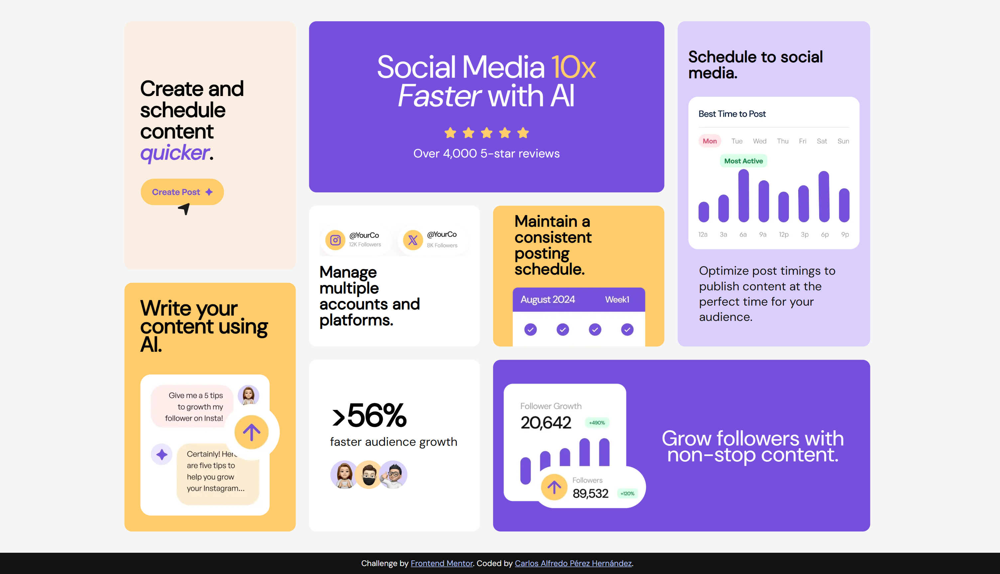

# Frontend Mentor - Bento grid solution

This is a solution to the [Bento grid challenge on Frontend Mentor](https://www.frontendmentor.io/challenges/bento-grid-RMydElrlOj). Frontend Mentor challenges help you improve your coding skills by building realistic projects.

## Table of contents

- [Overview](#overview)
  - [The challenge](#the-challenge)
  - [Screenshot](#screenshot)
  - [Links](#links)
- [My process](#my-process)
  - [Built with](#built-with)
  - [What I learned](#what-i-learned)
  - [Continued development](#continued-development)
  - [Useful resources](#useful-resources)
- [Author](#author)

## Overview

### The challenge

Users should be able to:

- View the optimal layout for the interface depending on their device's screen size

### Screenshot




### Links

- Solution URL: [https://github.com/CarlosPerez1999/FM-BentoGrid/]
- Live Site URL: [https://carlosperez1999.github.io/FM-BentoGrid/]

## My process

### Built with

- Semantic HTML5 markup
- CSS custom properties
- Flexbox
- CSS Grid
- Mobile-first workflow

### What I learned

CSS Grid Usage:

I learned how to structure a layout using grid-template-columns, grid-template-rows, and how to position elements with grid-column and grid-row.

```html
<section class="social-media">
  <h1>Social Media <span>10x</span> <span>Faster</span> with AI</h1>
  
  <p>Over 4,000 5-star reviews</p>
</section>
```

```css
.social-media {
  background-color: var(--purple-500);
  padding: 2.5rem 3rem;
  grid-column: 2 / 4;
  grid-row: 1;
}
```

Layout organization and planning:

I saw the importance of planning a design before implementing it, especially when working with complex layouts like the one in this exercise.

Mobile First Practice:

Although this exercise was more for a desktop layout, I realized how I could start with a mobile first layout and expand it to larger layouts with media queries.

### Continued development

Responsive and Mobile First Design:

I want to continue practicing the Mobile First approach to ensure my designs adapt optimally to different screen sizes.

CSS Grid Mastery:

Although I managed to structure this layout, I want to continue practicing using grid-auto-flow, grid-template-areas and advanced grid-column and grid-row combinations to handle even more complex layouts.

Experiment with dynamic grids that respond to the content and size of the container.

Typography and Spacing:

Practice adjusting visual hierarchy by using appropriate font sizes, weights, and spacing.
Continue improving alignment and spacing between elements to create visually appealing and readable layouts.

### Useful resources

- [Mdn web docs](https://developer.mozilla.org/en-US/docs/Web/CSS/grid) - This resource was instrumental in understanding the basics of CSS Grid, especially how to use grid-column, grid-row, and the difference between fr and absolute values. It is a reference that I will use constantly to review concepts.

## Author
- Frontend Mentor - [@CarlosPerez1999](https://www.frontendmentor.io/profile/yourusername)


